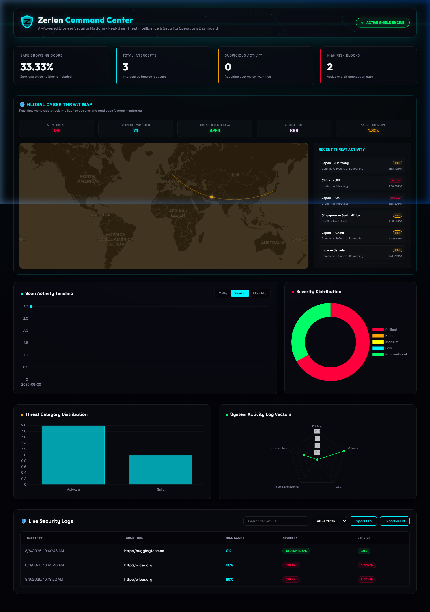
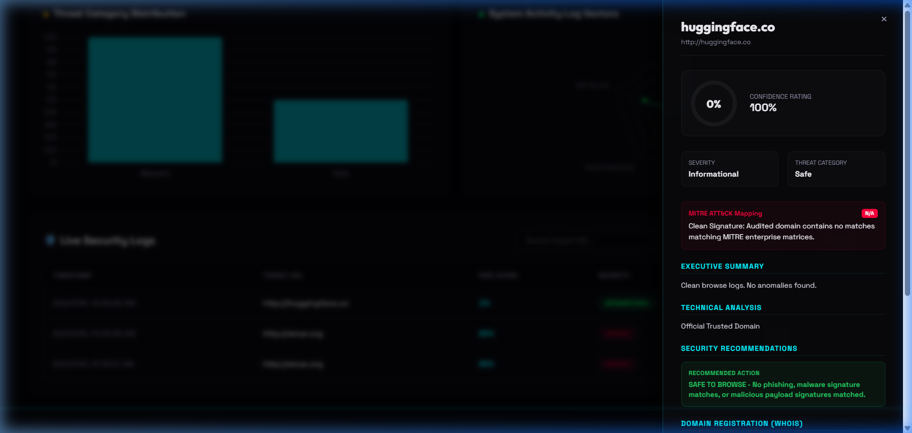
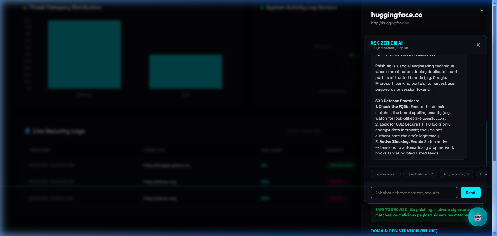
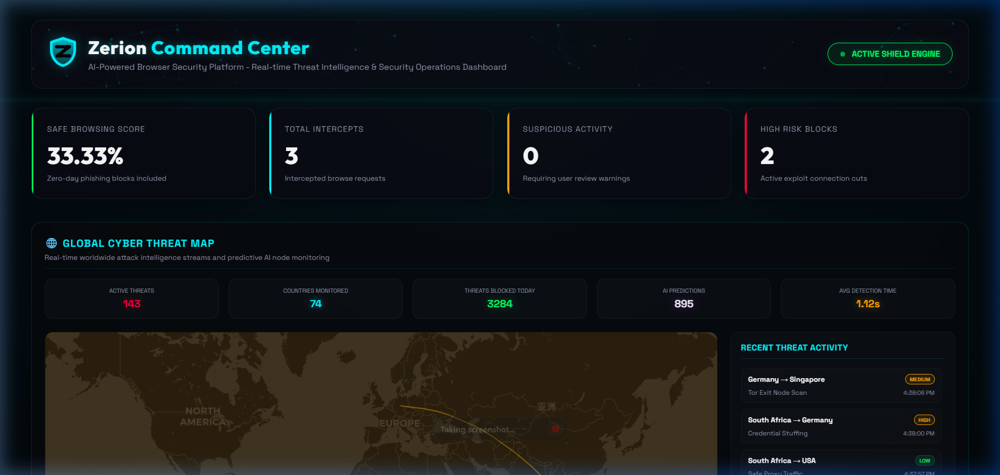
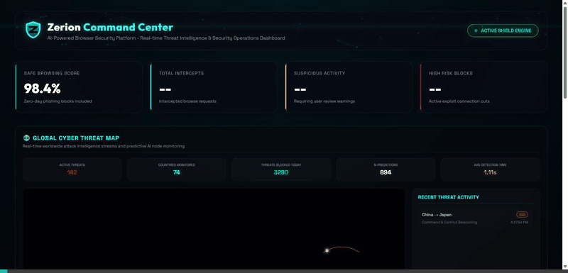
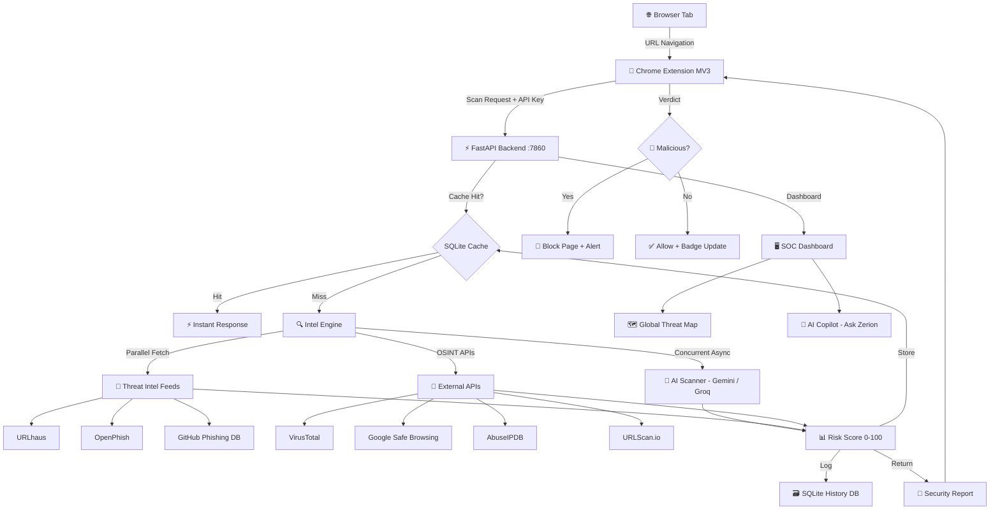

<p align="center">
  
</p>

<h1 align="center">Zerion AI Security</h1>

<p align="center">
  <strong>AI-Powered Browser Security & Threat Intelligence Platform</strong>
</p>

<p align="center">
  <a href="https://www.python.org/downloads/"></a>
  <a href="https://fastapi.tiangolo.com/"></a>
  <a href="https://developer.chrome.com/docs/extensions/mv3/"></a>
  <a href="https://deepmind.google/technologies/gemini/"></a>
  <a href="LICENSE"></a>
  <a href="#"></a>
  <a href="#"></a>
</p>

<p align="center">
  <a href="#-project-overview">Overview</a> •
  <a href="#-key-features">Features</a> •
  <a href="#-screenshots">Screenshots</a> •
  <a href="#-technology-stack">Tech Stack</a> •
  <a href="#-installation">Installation</a> •
  <a href="#-api-endpoints">API</a> •
  <a href="#-roadmap">Roadmap</a>
</p>

---

## 📌 Project Overview

**Zerion AI Security** is a next-generation, AI-powered browser security platform that identifies, analyzes, and neutralizes sophisticated web-based threats in real-time. Built as a Chrome Extension backed by a FastAPI intelligence engine, it provides enterprise-grade protection directly inside your browser.

Traditional security tools rely on static blacklists, leaving users exposed to zero-day phishing campaigns, credential harvesting, and obfuscated malicious scripts. Zerion AI Security changes this with:

- 🧠 **AI-driven threat scoring** using Google Gemini and Groq Llama
- 🌐 **Multi-source OSINT intelligence** (VirusTotal, URLhaus, OpenPhish, Google Safe Browsing)
- 🔒 **Real-time browser protection** via Chrome Extension (Manifest V3)
- 📊 **Enterprise SOC dashboard** with live global threat map
- 🤖 **AI Copilot** for interactive cybersecurity analysis

> Zerion AI Security is designed for security professionals, developers, and privacy-conscious users who demand more than checkbox compliance.

---

## ✨ Key Features

| Feature | Description | Status |
|---------|-------------|--------|
| 🔍 **AI URL Analysis** | Deep AI-powered scan of any URL for threats, scoring 0–100 | ✅ Live |
| 🎣 **Phishing Detection** | Real-time matching against 800K+ active phishing feeds | ✅ Live |
| 🦠 **Malware Detection** | Pattern analysis and feed-based malware URL identification | ✅ Live |
| 🧪 **VirusTotal Integration** | Cross-reference with 70+ antivirus engines via VT API | ✅ Live |
| 📋 **WHOIS Analysis** | Domain age, registrar, and registration history lookup | ✅ Live |
| 🔐 **SSL Certificate Validation** | Certificate issuer, expiry, and validity inspection | ✅ Live |
| 📡 **Threat Intelligence Feeds** | GitHub, URLhaus, OpenPhish — updated on every startup | ✅ Live |
| 🛡️ **Browser Protection** | Auto-block malicious tabs, alert overlays on dangerous sites | ✅ Live |
| 🧩 **Chrome Extension** | Lightweight MV3 extension with popup, controls, and history | ✅ Live |
| 📊 **Interactive Dashboard** | Full SOC dashboard with stats, charts, and scan history | ✅ Live |
| 📄 **Security Report Panel** | Glassmorphism report card with all OSINT fields per scan | ✅ Live |
| 🤖 **AI Copilot (Ask Zerion)** | Gemini-powered chatbot for contextual threat analysis | ✅ Live |
| 🗺️ **Global Threat Map** | Live interactive world map with animated attack paths | ✅ Live |
| ⚡ **Response Caching** | Sub-second responses via SQLite API cache layer | ✅ Live |
| 🚦 **Rate Limiting** | Token bucket algorithm protecting all API routes | ✅ Live |

---

## 📸 Screenshots

<table>
  <tr>
    <td align="center">
      
      <br/><sub><b>🖥️ Command Center Dashboard</b></sub>
    </td>
    <td align="center">
      
      <br/><sub><b>🧩 Chrome Extension Popup</b></sub>
    </td>
  </tr>
  <tr>
    <td align="center">
      
      <br/><sub><b>📄 AI Security Report Panel</b></sub>
    </td>
    <td align="center">
      
      <br/><sub><b>🗺️ Global Cyber Threat Intelligence Map</b></sub>
    </td>
  </tr>
</table>

---

## 🎬 Demo

<p align="center">
  
</p>

---

## 🛠️ Technology Stack

<table>
  <tr>
    <th>Layer</th>
    <th>Technology</th>
    <th>Purpose</th>
  </tr>
  <tr>
    <td><b>Frontend</b></td>
    <td>HTML5, CSS3, JavaScript (ES6+)</td>
    <td>Dashboard UI, Extension popup, Threat Map</td>
  </tr>
  <tr>
    <td><b>Backend</b></td>
    <td>Python 3.10+, FastAPI, Uvicorn</td>
    <td>REST API, Threat Intelligence Engine</td>
  </tr>
  <tr>
    <td><b>Database</b></td>
    <td>SQLite3</td>
    <td>Scan history, API cache, Threat reports</td>
  </tr>
  <tr>
    <td><b>AI / ML</b></td>
    <td>Google Gemini, Groq Llama 3</td>
    <td>Threat scoring, AI Copilot, NLP analysis</td>
  </tr>
  <tr>
    <td><b>Threat Intel</b></td>
    <td>VirusTotal, URLhaus, OpenPhish, Safe Browsing</td>
    <td>Multi-source OSINT threat verification</td>
  </tr>
  <tr>
    <td><b>Extension</b></td>
    <td>Chrome Extension Manifest V3</td>
    <td>Real-time browser protection layer</td>
  </tr>
  <tr>
    <td><b>Mapping</b></td>
    <td>Leaflet.js (local bundle, CSP-compliant)</td>
    <td>Interactive global threat intelligence map</td>
  </tr>
  <tr>
    <td><b>Security</b></td>
    <td>Token Bucket Rate Limiter, XSS sanitizer, Secure Headers</td>
    <td>API protection & input sanitization</td>
  </tr>
</table>

---

## 🏗️ Architecture



---

## 🚀 Installation

### Prerequisites

- Python 3.10+
- Google Chrome browser
- API Keys: `GEMINI_API_KEY`, `VIRUSTOTAL_API_KEY` (optional but recommended)

---

### 1. Clone the Repository

```bash
git clone https://github.com/mohitsoniai/zerion-ai-security.git
cd zerion-ai-security
```

---

### 2. Set Up Environment Variables

Create a `.env` file in the project root:

```env
GEMINI_API_KEY=your_gemini_api_key_here
GROQ_API_KEY=your_groq_api_key_here
VIRUSTOTAL_API_KEY=your_virustotal_api_key_here
GOOGLE_SAFE_BROWSING_API_KEY=your_gsb_key_here
ZERION_API_KEY=zerion_secret_key_v2
JWT_SECRET=your_secure_jwt_secret
```

---

### 3. Install Python Dependencies

```bash
pip install -r backend/requirements.txt
```

---

### 4. Start the Backend Server

```bash
python -m backend.app
```

The server will start at: **http://localhost:7860**

> On first launch, Zerion automatically downloads 800K+ threat intelligence entries from URLhaus, OpenPhish, and GitHub feeds concurrently.

---

### 5. Load the Chrome Extension

1. Open Chrome and navigate to `chrome://extensions/`
2. Enable **Developer Mode** (toggle top-right)
3. Click **Load unpacked**
4. Select the `extension/` folder from this repository
5. The **Zerion Browser Guard** icon will appear in your toolbar

---

### 6. Open the Dashboard

Visit: **http://localhost:7860**

---

### 🐳 Docker (Alternative)

```bash
docker-compose up --build
```

---

## 📡 API Endpoints

| Method | Endpoint | Description | Auth |
|--------|----------|-------------|------|
| `GET` | `/` | Zerion Command Center Dashboard | None |
| `GET` | `/health` | System health check — DB, feeds, cache status | None |
| `POST` | `/analyze` | Full AI + OSINT URL threat scan | API Key |
| `POST` | `/copilot` | Ask Zerion AI cybersecurity questions | None |
| `GET` | `/dashboard/stats` | Aggregated scan statistics | None |
| `GET` | `/dashboard/recent` | Recent scan history records | None |
| `GET` | `/trusted-domains` | Tranco Top 10K safe domain list | None |
| `POST` | `/report` | Submit a manual threat report | None |

### Example Request

```bash
curl -X POST http://localhost:7860/analyze \
  -H "Content-Type: application/json" \
  -H "X-API-Key: zerion_secret_key_v2" \
  -d '{"url": "https://example.com", "username": "analyst"}'
```

### Example Response

```json
{
  "verdict": "SAFE",
  "threat_score": 2,
  "confidence_score": 98,
  "threat_category": "Safe",
  "severity": "Informational",
  "explanation": "Domain is well-established with valid SSL and no threat feed matches.",
  "ssl_analysis": "Valid — DigiCert Inc",
  "domain_age": 9500,
  "vt_data": { "malicious": 0, "total": 89 },
  "risk_score": 2
}
```

---

## 📁 Folder Structure

```
zerion-ai-security/
│
├── assets/                        # Static assets
│   ├── banner.png                 # GitHub repository banner
│   ├── demo.gif                   # Demo animation
│   └── screenshots/               # Feature screenshots
│
├── backend/                       # FastAPI backend
│   ├── app.py                     # Application entry point
│   ├── config/
│   │   └── settings.py            # Environment config & secrets
│   ├── controllers/
│   │   ├── analyze.py             # URL scan & threat analysis
│   │   ├── copilot.py             # AI Copilot endpoint
│   │   └── dashboard.py           # Dashboard data endpoints
│   ├── database/
│   │   └── db.py                  # SQLite schema, queries & indexes
│   ├── middlewares/
│   │   ├── security.py            # Rate limiter, XSS sanitizer, headers
│   │   └── error_handler.py       # Global exception handler
│   ├── services/
│   │   ├── ai_scanner.py          # Hybrid AI scanner (Gemini + Groq)
│   │   ├── intel_engine.py        # Unified OSINT API orchestrator
│   │   └── threat_intel.py        # Feed manager (URLhaus, OpenPhish)
│   ├── templates/
│   │   └── dashboard.html         # Jinja2 SOC dashboard template
│   ├── utils/
│   │   ├── domain.py              # WHOIS + SSL domain utilities
│   │   └── logger.py              # Structured JSON logging
│   └── requirements.txt
│
├── extension/                     # Chrome Extension (MV3)
│   ├── manifest.json              # Extension manifest
│   ├── background.js              # Service worker & threat sync
│   ├── content.js                 # Page content scanner
│   ├── hover_script.js            # Link hover risk preview
│   ├── popup.html / popup.js      # Extension popup UI
│   ├── dashboard.html / .js       # Full extension dashboard
│   ├── blocked.html / .js         # Threat block page
│   ├── content.css                # Content script styles
│   ├── popup.css                  # Popup styles
│   ├── icons/                     # Extension icons
│   └── libs/                      # Local Leaflet.js (CSP-compliant)
│
├── docs/                          # Documentation
│   ├── API_DOCUMENTATION.md
│   ├── DEPLOYMENT_GUIDE.md
│   ├── SYSTEM_ARCHITECTURE.md
│   └── SECURITY.md
│
├── .github/
│   └── workflows/
│       └── deploy.yml             # CI/CD pipeline
│
├── .eslintignore                  # ESLint vendor exclusions
├── .gitattributes                 # Git LFS config
├── Dockerfile                     # Docker build config
├── docker-compose.yml             # Docker Compose
├── package.json                   # Node.js lint tooling
├── render.yaml                    # Render.com deployment
└── README.md
```

---

## 🔮 Roadmap

| Feature | Priority | Status |
|---------|----------|--------|
| 📄 PDF Security Report Export | High | 🔄 Planned |
| 📧 Email Threat Alerts | High | 🔄 Planned |
| 🌍 Multi-Browser Support (Firefox, Edge) | Medium | 🔄 Planned |
| 👤 User Accounts & Auth | Medium | 🔄 Planned |
| ☁️ Cloud-Hosted Dashboard | High | 🔄 Planned |
| 🔮 AI Threat Prediction Engine | High | 🔄 Planned |
| 📱 Mobile Companion App | Low | 💡 Ideation |
| 🔗 SIEM / SOAR Integration | Medium | 💡 Ideation |
| 🧩 Firefox Extension Port | Medium | 🔄 Planned |
| 🏢 Enterprise Multi-Tenant SaaS | High | 💡 Ideation |

---

## 🤝 Contributing

Contributions are welcome! Whether it's a bug fix, feature request, or documentation improvement — all PRs are appreciated.

### Steps

```bash
# 1. Fork the repository
# 2. Create a feature branch
git checkout -b feature/your-feature-name

# 3. Make your changes and commit
git commit -m "feat: add your feature description"

# 4. Push to your fork
git push origin feature/your-feature-name

# 5. Open a Pull Request
```

### Guidelines

- Follow existing code style and structure
- Add comments for complex logic
- Test your changes before submitting
- Keep PRs focused — one feature per PR
- Update documentation if needed

---

## 📄 License

This project is licensed under the **MIT License** — see the [LICENSE](LICENSE) file for details.

```
MIT License — Free to use, modify, and distribute with attribution.
```

---

## 👨‍💻 Developer

<p align="center">
  <b>Mohit Swarnkar</b><br/>
  <i>Full Stack Developer & AI Engineer</i><br/><br/>
  <a href="https://github.com/mohitsoniai">
    
  </a>
</p>

---

<p align="center">
  <sub>Built with ❤️ and Python by Mohit Swarnkar</sub>
  <br/><br/>
  <b>⭐ If you found this project useful, consider giving it a Star — it really helps!</b>
</p>
