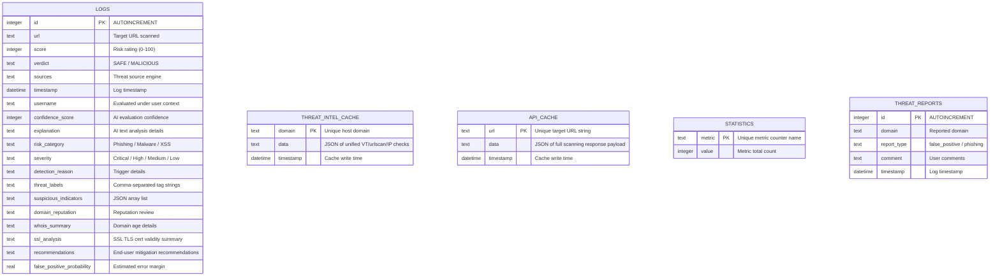

# Zerion AI v2 - Entity Relationship Diagram

This document describes the schema structure of the local SQLite database which tracks threat audit history and keeps operational caches.

---

## 📊 Database Schema Relationships

The database is schema-less by nature of SQLite, but structured tables enforce strict columns for cache integrity and history logging.

---

## 🗃️ Column Catalog Descriptions

### 1. `logs` (Threat History Logs)
* **`id`**: Auto-incrementing unique integer key.
* **`url`**: The fully resolved web address scanned.
* **`score`**: Composite index grading risk between `0` (totally safe) and `100` (critical danger).
* **`verdict`**: Final decision categorical text string (e.g. `SAFE`, `SUSPICIOUS`, `MALICIOUS`).
* **`confidence_score`**: Model self-assessment percentage.
* **`suspicious_indicators`**: JSON array string of detected heuristics (e.g. `["homoglyph-detected", "newly-registered"]`).
* **`false_positive_probability`**: Numeric probability value from 0.0 to 100.0 indicating estimation error chances.

### 2. `threat_intel_cache` (Reputation API Caches)
* **`domain`**: Host domain (e.g. `bad-url.xyz`).
* **`data`**: Serialized JSON record compiling VirusTotal scans, IP abuse history, and Safe Browsing checks.
* **`timestamp`**: Lifespan control timestamp. Refreshes every **12 hours**.

### 3. `api_cache` (Model Scan Cache)
* **`url`**: Full target URL.
* **`data`**: Serialized response payload cache to bypass calling Gemini/Llama models again for identical links.
* **`timestamp`**: Lifespan control timestamp. Refreshes every **4 hours**.
