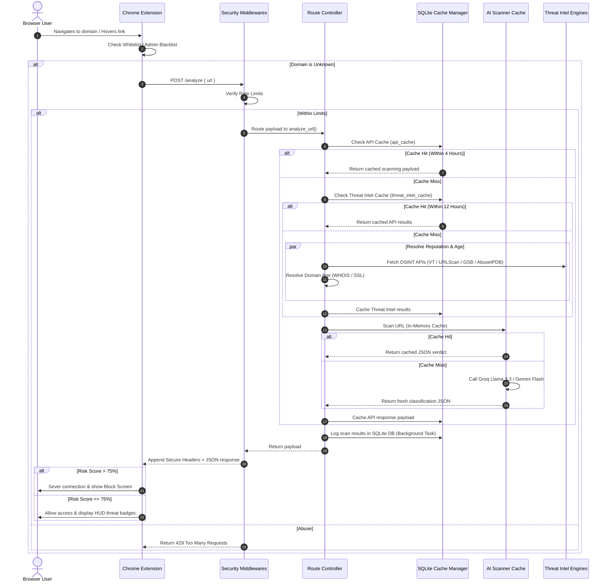

# WADE AI v2 - System Architecture

WADE (Web AI Defense Engine) is designed as a modular, service-oriented browser security platform that provides real-time protection against phishing, script-based attacks (XSS), and social engineering threats. It integrates browser-native sensors with dual large language model (LLM) reasoning and structured reputation intelligence.

---

## 🏛️ System Overview

The platform is structured into three primary architectural tiers:

```mermaid
graph TD
    User([User Browser]) <--> Ext[WADE Chrome Extension]
    Ext <--> BE[WADE FastAPI Backend]
    
    subgraph Browser Sandbox (The Eyes)
        Ext --> CS[Content Scripts - DOM Scanner]
        Ext --> HS[Hover Script - Real-time Link Auditor]
        Ext --> DB[HTML5/JS Management Dashboard]
    end
    
    subgraph Core Engine (The Brain)
        BE --> Config[Configuration Manager settings.py]
        BE --> Mid[Middlewares RateLimit / SecureHeaders]
        BE --> Ctrl[Controllers analyze.py / dashboard.py]
        BE --> Database[Database Manager db.py]
        BE --> Services[Services threat_intel.py / intel_engine.py / ai_scanner.py]
        BE --> Utils[Utils logger.py / domain.py]
    end
    
    subgraph AI Reasoning (Decision Matrix)
        Services --> Llama[Groq: Llama 3.3 70B]
        Services --> Gemini[Google: Gemini 1.5 Flash]
    end
```

---

## 🔧 Component Breakdown

### 1. Browser Security Layer (The Eyes)
Developed as a Chrome Manifest V3 extension, running inside the browser sandbox:
* **Background Worker (`background.js`):** The orchestrator of the extension. It intercepts navigation requests, runs URL matches against the local whitelist/blacklist/ignored cache, handles inter-process messaging, updates badge states, and directs scans to the backend. Bypasses blocking notifications for sites in the Ignored Domains list.
* **Content Scripts (`content.js`):** Script injected into web pages. It neutralizes inline scripting (`onclick`, `onmouseover`, `javascript:` protocol) and scans live page elements for dynamic injections.
* **Hover Script (`hover_script.js`):** Monitors pointer events on links. If a user hovers over an external URL for more than 800ms, it initiates an out-of-band threat audit and displays a Heads-Up Display (HUD) warning.
* **Command Center Dashboard (`dashboard.html` / `dashboard.js`):** A cyberpunk-styled management console with a 3D-perspective tilt interface. It tracks scan history, allows whitelisting/blacklisting/ignoring domains, and displays advanced analytics charts with Daily, Weekly, and Monthly switches. Includes CSV/JSON exports and filtering controls.
* **Modernized Popup Interface (`popup.html` / `popup.js`):** Custom popup layout featuring auto-scan toggling, quick analyst feedback forms that POST directly to the backend `/report` endpoint, Light/Dark mode state management, and site whitelist switches.

### 2. Analytical Backend Services (The Brain)
Restructured as a modular MVC backend:
* **Configuration Module (`config/settings.py`):** Loads credential settings (Groq, Gemini, VirusTotal, Safe Browsing, AbuseIPDB, SQLite paths) using robust environment loaders.
* **Security Middlewares (`middlewares/security.py`):** Enforces IP-based Token Bucket rate limiting, request query parameter validation, and secure security headers (`Helmet` equivalent). Operates fully open without authentication checks. Exposes input sanitization helper (`sanitize_input`).
* **Database Manager (`database/db.py`):** Manages SQLite connections, caching scopes (`api_cache` and `threat_intel_cache` tables) to minimize external API consumption, pre-calculated `statistics` counters, and user-submitted `threat_reports`.
* **Controllers (`controllers/analyze.py`, `dashboard.py`):** Define REST routing endpoints: `/analyze` for scans, `/report` for quick threat reports, and `/dashboard/stats` / `/dashboard/recent` for statistics.
* **Services Layer:**
      * `services/threat_intel.py`: Daily synchronizer for open-source threat feeds (URLHaus, PhishingDB, OpenPhish).
      * `services/intel_engine.py`: Unified API orchestrator checking Safe Browsing, VirusTotal, URLScan, AbuseIPDB, and OpenPhish feeds.
      * `services/ai_scanner.py`: Coordinates Groq Llama and Gemini API calls with local in-memory LRU caching. Leverages domain WHOIS and SSL certificate details in the prompt context.
* **Utilities (`utils/logger.py`, `domain.py`):** Provides structured JSON logging utilities and WHOIS/SSL domain details extraction (registrar, age, SSL valid, SSL issuer, SSL expiry).

---

## 🔄 Sequence of Operations

The sequence below illustrates a request lifecycle when a user navigates to an unknown webpage or hovers over a link:



---

## 🔒 Security & Performance Features

* **Open Architecture:** Fully transparent, bypasses session logins and user keys validation.
* **Token Bucket Rate Limiting:** Restricts client requests based on configurable burst capacities and refill rates.
* **Secure Headers (Helmet Equivalent):** Defends against frame hijacking, XSS execution, and sniffing exploits.
* **SQLite Dual Cache:** Reduces latency to subseconds for recurring threat scans.
* **Real-time Input Sanitization:** Middleware query param block and Pydantic validators protect the backend API from injection vulnerabilities.
* **Pre-calculated Statistics Cache:** Minimizes query overhead for timeline and distribution calculations.
